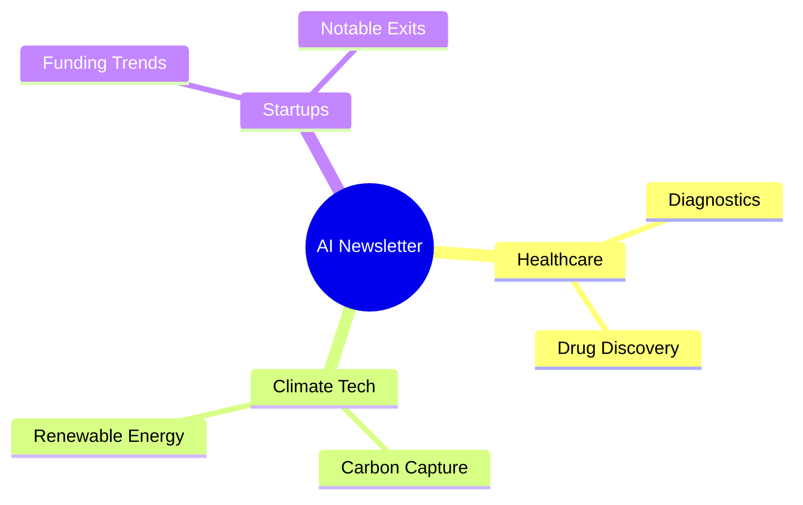

# Phase 9: Mindmap Agent Implementation

## Goal
Visual knowledge map generation

## Status
- [ ] Not Started

## Files to Create
```
backend/app/platforms/newsletter/agents/mindmap/
├── agent.py           # MindmapAgent
├── chain.py
└── prompts/
```

## Agent Tasks
- `generate_mindmap()`: Mermaid format mindmap
- `analyze_content_structure()`: Topic extraction
- `create_topic_mindmap()`: Topic-focused maps

## Features
- Multi-tier fallback (LLM → Enhanced → Basic)
- Hierarchical topic organization
- SVG export for email attachment
- Keyword clustering

## How It Helps The Project

The Mindmap Agent creates **visual summaries** of newsletter content:

### Output Example


### The Flow
1. Receives generated newsletter content from Writing Agent
2. Analyzes content structure and extracts key topics
3. Generates hierarchical mindmap in Mermaid format
4. Converts to SVG for email embedding
5. Included in **HITL Checkpoint 3** review

### Fallback Strategy
1. **LLM Generation**: Use AI to create intelligent topic hierarchy
2. **Enhanced Fallback**: Extract keywords + basic clustering
3. **Basic Fallback**: Simple bullet-point hierarchy

## Dependencies
- Phase 7 (Writing Agent output)
- Framework BaseAgent
- Mermaid library (for SVG rendering)

## Verification
- [ ] Generates valid Mermaid syntax
- [ ] SVG export works
- [ ] Fallback tiers work correctly
- [ ] Handles various content structures
- [ ] Tests passing
